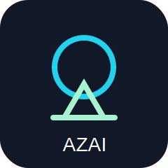

# AZAI

<p align="center">
  <strong>AI-Driven Xylazine Analytics and Innovation</strong><br>
  <em>AZAI is an open-source AI platform for xylazine-focused molecular intelligence and fluorescent probe discovery.</em>
</p>

<p align="center">
  
</p>

## Mission

AZAI helps researchers analyze xylazine and related molecular structures, prioritize fluorescent probe concepts, and generate transparent, reproducible cheminformatics reports for analytical chemistry and medicinal chemistry education.

## Safety statement

AZAI is intended for analytical chemistry, public health research, forensic detection, molecular characterization, fluorescent probe discovery, and medicinal chemistry education. It must not be used to optimize xylazine potency, abuse potential, harmful delivery, clandestine synthesis, or illicit drug production. The initial scoring models are heuristic and educational until validated with experimental data.

## What is included in this MVP

- RDKit molecule loading and standardization helpers
- Xylazine reference profile
- Molecular descriptors: MW, LogP, TPSA, HBD, HBA, rotatable bonds, formal charge, aromatic rings, heteroatoms
- Morgan and MACCS fingerprints
- Xylazine similarity ranking for CSV inputs
- Built-in fluorophore library
- Transparent probe scoring from 0 to 100
- Streamlit MVP app
- Example command-line script
- Pytest tests
- GitHub Actions CI
- Docker-ready scaffold

## Repository architecture

```text
AZAI/
├── azai/                  # Python package
│   ├── molecules/         # descriptors, fingerprints, similarity, visualization
│   ├── xylazine/          # xylazine reference data and interpretation
│   ├── fluorescence/      # fluorophore library and probe concepts
│   ├── scoring/           # transparent probe scoring and ranking
│   └── utils/             # IO, safety, logging helpers
├── app/                   # Streamlit web app
├── examples/              # runnable example scripts
├── tests/                 # pytest tests
├── docs/                  # project documentation
└── data/                  # placeholder data folders
```

## Installation

```bash
git clone https://github.com/drjoykarmakar/AZAI.git
cd AZAI
python -m venv .venv
source .venv/bin/activate  # Windows: .venv\\Scripts\\activate
pip install -e .
```

RDKit is easiest to install with conda/mamba:

```bash
mamba env create -f environment.yml
mamba activate azai
pip install -e .
```

## Quickstart

Analyze xylazine and rank example molecules:

```bash
python examples/xylazine_probe_demo.py
```

Run tests:

```bash
pytest
```

Launch the web app:

```bash
streamlit run app/streamlit_app.py
```

## Example Python use

```python
from azai.xylazine.reference import XYLAZINE
from azai.molecules.descriptors import calculate_descriptors
from azai.molecules.similarity import tanimoto_to_reference

print(calculate_descriptors(XYLAZINE.smiles))
print(tanimoto_to_reference("CN1CCN(CC1)C2=Nc3ccccc3S2", XYLAZINE.smiles))
```

## Methodology summary

AZAI starts with transparent cheminformatics baselines. Molecules are parsed with RDKit, converted into descriptors and fingerprints, compared with similarity metrics, and scored with explicit rules. Probe scores are not experimental predictions; they are prioritization hypotheses designed to guide literature review and early experiments.

## Fluorescent probe concept scoring

The MVP scoring model combines:

- xylazine recognition potential
- fluorescence response probability
- synthetic accessibility
- selectivity risk
- aqueous compatibility
- expected sensitivity
- novelty
- safety and practicality
- interpretability

Each score includes component values, an explanation, confidence, and a recommended next experiment.

## Roadmap

- Phase 1: Core cheminformatics MVP
- Phase 2: Probe design engine and ranking
- Phase 3: Explainable tabular AI and atom highlighting
- Phase 4: Literature-aware local retrieval assistant
- Phase 5: Docker, docs, model cards, reports, and polished release

## Contributing

Contributions are welcome. Good first issues include adding descriptor tests, improving Streamlit pages, extending fluorophore metadata, adding example datasets, and writing documentation. Please keep all contributions aligned with analytical chemistry, public health, and education.

## Citation

If AZAI supports your work, cite the repository and include the version or commit hash used. A formal citation file will be added after the first public release.
